# TAL-style Memory Layer - Demo

A working miniature of one problem: **how does an AI coach remember a student across
months of conversations, without stuffing the whole history into every prompt?**

Built as a study of the memory-layer architecture used by AI coaching products
(Postgres + pgvector + LLM extraction + row-level security), sized to be read
in 15 minutes.

> **Architecture canon.** This README is the narrative intro. The structured,
> C4-leveled architecture - system context, system design, domain model,
> cross-cutting concerns - is the living canon in
> [`docs/architecture/`](docs/architecture/), with the durable decisions as ADRs
> in [`docs/adr/`](docs/adr/). In the running demo it is browsable in-brand at
> [`/architecture`](http://localhost:8000/architecture).

---

## 1. The problem, in plain words

Imagine a life-coach chatbot for trading students. Call it TAL.

An LLM is **stateless**. It has no memory of its own. Its "knowledge" of the
student during a conversation is exactly what the app puts into the prompt:

- the student's personality quiz report, and
- the messages of the *current* conversation.

When the session ends, everything the student shared is gone from TAL's view.
It sits in chat logs, but TAL never sees it again. A student who has talked to
TAL for 100 hours over six months still gets treated like a stranger on day one.

The naive fix - "just paste the whole history into the prompt" - fails three ways:

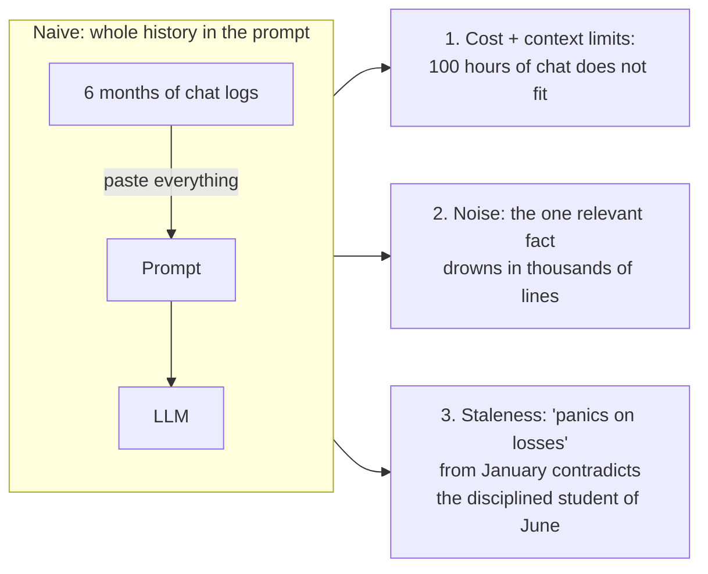

So the real requirement (quoted from the job post) is:

> "It should recall meaningful things they've shared, notice patterns over time,
> and let its understanding of them evolve, **without context bloat, hallucinated
> memories, or stale information** getting in the way of a present conversation."

The answer to that requirement is a **memory layer**.

## 2. What a memory layer is

Two separate stores with different jobs, connected by two pipelines:

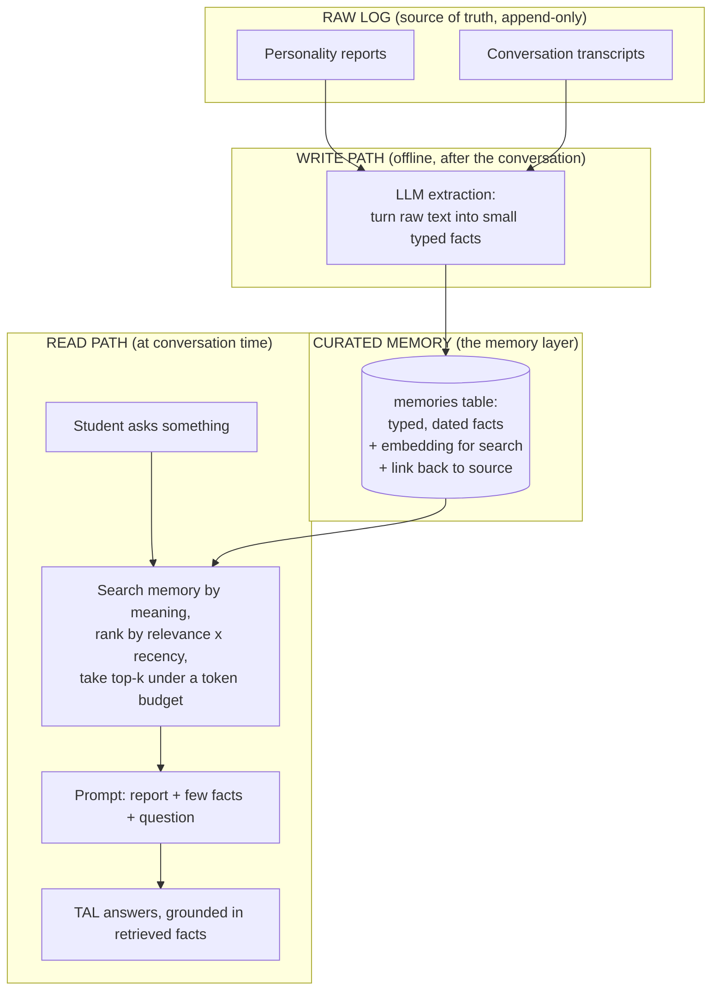

Core principle: **separate the raw log from curated memory, and never trust the
model to remember.**

- The raw log is never deleted and never goes into a prompt wholesale.
- Memory holds small, *typed* facts: "trait: exits winners too early",
  "goal: build confidence to let winners run". Each fact is dated and points
  back to the exact source text it came from (**provenance**).
- At conversation time TAL gets the personality report plus a handful of the
  most relevant and recent facts. Not the history. That kills context bloat.
- Facts are **versioned, never overwritten**. When the student changes
  ("used to panic on losses, now more disciplined"), a new fact is written and
  the old one is marked superseded. That is how the system notices patterns
  instead of contradicting itself - and it answers "stale information".
- TAL may only state things it actually retrieved, each traceable to a source.
  That answers "hallucinated memories".

## 3. The specific task this demo mirrors

The real company already has: TAL in production, a memory layer v1 on
Postgres + pgvector, voice chat, integrated logins. Their stated remaining work
(the paid trial) is:

> "migrating our existing student reports into the new memory layer and
> tightening up the memory system itself"

This demo is a miniature of exactly that:

| Real trial | Demo equivalent |
|---|---|
| Existing student personality reports | `raw_reports` table, seeded with 2 fake reports |
| Migrate them into the memory layer | `POST /migrate` - extraction pipeline fills `memories` |
| The memory layer itself | `memories` table: typed facts, embeddings, provenance, versioning |
| Tighten the memory system | ranked retrieval under a budget, RLS isolation, leakage test |
| TAL uses memory in conversation | `GET /students/{id}/ask?q=...` - grounded answer |

## 4. The two flows, end to end

### Flow A - Migration / ingestion (the write path)

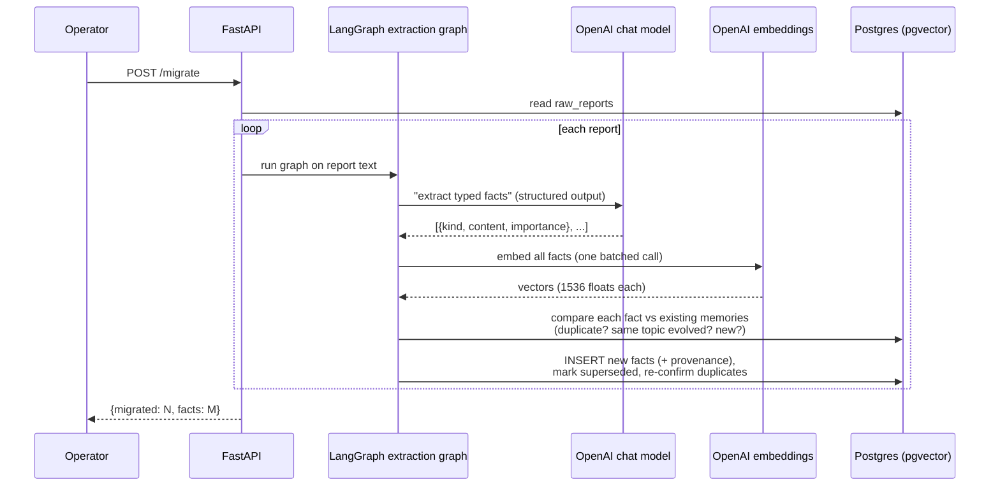

Why LangGraph appears as a participant here: it owns control flow. The API
hands it the report and the graph runtime decides what runs when - which is
what makes something a box in a sequence diagram.

### Flow B - Conversation (the read path)

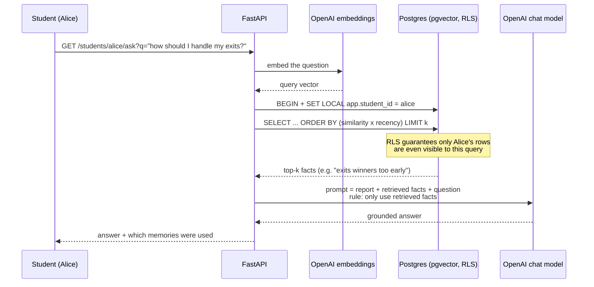

The response includes *which* memories were used - provenance surfaced to the
caller. In production that becomes an audit trail.

**LangGraph is deliberately absent from the read path.** This flow is linear,
stateless and request-scoped: embed, query, one LLM call, return. There is no
multi-step state to carry, nothing to branch on, nothing to resume - a graph
would add ceremony, not value. In a production coaching product the
*conversation loop itself* is the stateful thing (long sessions, dropped voice
calls, turn accumulation) - that is where a checkpointer-backed graph earns
its place. This demo's one-shot `/ask` is the deliberate simplification of
that.

## 5. Data model

Three groups: RAW SOURCES (append-only log), the MEMORY LAYER (curated
facts), and two AUDIT LEDGERS (one per pipeline direction).

```mermaid
erDiagram
    students ||--o{ raw_reports : has
    students ||--o{ conversations : has
    conversations ||--o{ messages : contains
    students ||--o{ memories : has
    raw_reports ||--o{ memories : "is source of"
    conversations ||--o{ memories : "is source of"
    memories o|--o| memories : supersedes
    students ||--o{ extraction_audit : "write-path ledger"
    memories o|--o{ extraction_audit : "decision about"
    students ||--o{ retrieval_audit : "read-path ledger"

    students {
        uuid id PK
        text external_id UK "identity in the SOURCE system (import)"
        text name
    }
    raw_reports {
        uuid id PK
        text external_id UK "import idempotency key"
        uuid student_id FK
        text content "legacy report text"
        timestamptz created_at "event time"
        timestamptz migrated_at "ledger: NULL = not yet migrated"
    }
    conversations {
        uuid id PK
        text external_id UK
        uuid student_id FK
        timestamptz started_at "event time"
        timestamptz ingested_at "ledger: NULL = not yet distilled"
    }
    messages {
        uuid id PK
        uuid conversation_id FK
        uuid student_id FK "denormalized for RLS"
        text role "student | coach"
        text content
        timestamptz created_at
    }
    memories {
        uuid id PK
        uuid student_id FK "RLS key"
        text kind "trait | goal | struggle | event | preference"
        text content "one small fact"
        vector embedding "1536 dims, for meaning-based search"
        real importance "0..1, set by the extractor"
        uuid source_report_id FK "provenance (report)"
        uuid source_conversation_id FK "provenance (conversation)"
        timestamptz source_created_at "EVENT time - decides supersede direction"
        uuid superseded_by FK "versioning, never delete"
        timestamptz created_at "ingestion time"
        timestamptz last_confirmed_at "drives recency ranking"
    }
    extraction_audit {
        uuid id PK
        uuid student_id FK
        uuid source_report_id FK
        uuid source_conversation_id FK
        text fact_kind
        text fact_content "what the extractor produced"
        text action "insert | confirm | supersede | archive | skip"
        uuid memory_id FK "row written or confirmed"
        uuid matched_memory_id FK
        text matched_content "matched fact AS IT READ at decision time"
        text judge_relation "new | duplicate | evolution | sibling-dup"
        text judge_reason
        real nearest_distance
        text review_status "pending | approved | flagged"
        text review_note
        timestamptz reviewed_at
    }
    retrieval_audit {
        uuid id PK
        uuid student_id FK
        text question
        text answer
        jsonb retrieved "RANKING SNAPSHOT: memory_id, kind, content, score, rank"
        text model
        timestamptz created_at
        timestamptz flagged_at "flag-only review (streams never complete)"
        text review_note
    }
```

Deliberate decisions (each is an interview talking point):

1. **`superseded_by`, not UPDATE/DELETE.** History is data. "Alice used to exit
   early (Jan), Alice lets winners run now (Jun)" is a *pattern*, and patterns
   are the product ("notice patterns over time"). Overwriting facts destroys them.
2. **`source_report_id` provenance.** The anti-hallucination rule ("only state
   what you retrieved") is only enforceable if every fact traces to its source.
3. **No vector index (HNSW) - on purpose.** ANN indexes exist for searching
   millions of vectors. Here every search is scoped to ONE student's few hundred
   rows; an exact scan is faster, simpler, and exact. Knowing when NOT to add
   infrastructure is the point.
4. **Supersede direction = source dates, not processing order.** Each fact
   stores `source_created_at` (the source document's own date); reconcile only
   lets a strictly NEWER source overturn a live fact, and an older source's
   fact is archived (inserted already-superseded). Found empirically: before
   this, a re-run resurrected "panics on losses" over the follow-up's facts.
   Makes any processing order safe across reports and conversations.
5. **Reconcile is decided by an LLM judge, not a cosine threshold.** Cosine
   only shortlists candidates (a generous net, across kinds); the judge picks
   the relation, and dates pick the direction. Measured live: "panics" vs "no
   longer panics" sit 0.49 apart (cosine is blind to negation) and "score
   8/10" vs "7/10" sit 0.012 apart (blind to numbers) - so no distance cutoff
   can be trusted with the decision, in either direction.
6. **The judge call is JOINT per source, backed by a deterministic validator.**
   Per-fact decisions are all made against the pre-batch store snapshot, so two
   sibling facts matching the same live fact caused a lost update (one
   superseded it, one confirmed it - the confirmed claim vanished from live
   memory; found via agent triage of human-flagged reviews). Industry-standard
   fix shape (Mem0's joint ADD/UPDATE/DELETE/NOOP call, Graphiti's new-vs-new
   dedupe): one judge call sees all new facts + all candidates and decides the
   set coherently; `validate_plan` then enforces write-write coherence in code
   (LLM output is still just output). The reconcile judge runs on a stronger
   model than the workhorse - it is the highest-stakes call in the write path,
   offline, and now only one call per source.

## 6. Isolation: row-level security (RLS)

These are psychological profiles of real people, and the company is moving into
FCA-regulated territory. "Student A's memories must never surface in student B's
session" cannot depend on every developer remembering a WHERE clause. It is
enforced in the database:

```sql
CREATE POLICY per_student_memories ON memories
    USING (student_id = current_setting('app.student_id')::uuid);
```

Per request, the app does:

```sql
BEGIN;
SET LOCAL app.student_id = '<the authenticated student>';
-- every query in this transaction can only see that student's rows
COMMIT;
```

Two traps this demo demonstrates live:

- **The owner bypasses RLS.** Connect as `postgres` (table owner) and you see
  everything, silently - RLS enabled or not. The app therefore connects as a
  separate role (`tal_app`). If your app connects as the owner/migration user,
  your isolation story evaporates without a single error.
- **`SET LOCAL`, not `SET`.** With a connection pooler in transaction mode,
  plain `SET` leaks the student id to whoever gets the pooled connection next.
  `SET LOCAL` dies with the transaction. This is the classic multi-tenant
  RLS bug.

And one automated proof: `tests/test_isolation.py` asks Bob's question in
Alice's session and asserts that none of Bob's memories can leak into it.

## 7. The extraction pipeline as a LangGraph graph

The write path is a small state machine. LangGraph models it explicitly:

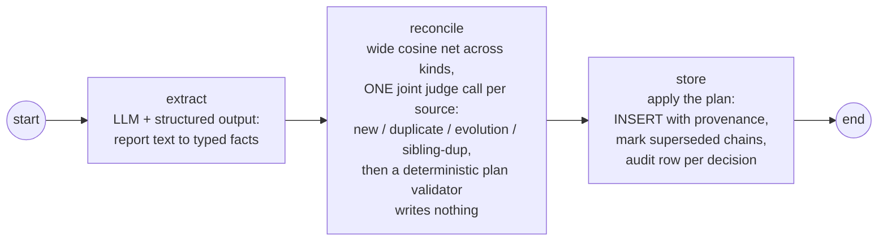

LangGraph is a state-machine / workflow runtime for LLM steps - a workflow
orchestrator, not a framework that "does AI". The pieces:

- **State**: a typed object passed between steps (here: report text, extracted
  facts, reconciled facts).
- **Nodes**: plain functions that take state and return updates (each may call
  an LLM, or just run code).
- **Edges**: which node runs next; can be conditional.
- **Checkpointer** (not used in this demo): persists state after every node,
  so a long-running graph can resume - that is how LangGraph does durable
  conversations ("threads").

Why a graph instead of three function calls? For 3 linear steps it IS
overkill - and saying so is the senior answer. It earns its place when steps
need retries, branching (e.g. "low-confidence extraction goes to human
review"), persistence mid-flow, or observability per step. The demo uses it
because the real system lists agent frameworks in its stack, and the graph
makes the pipeline's shape explicit and testable.

### 7.1 Inside reconcile: from N facts to a coherent plan

Reconcile is where most of the engineering lives. The stages, for one source:

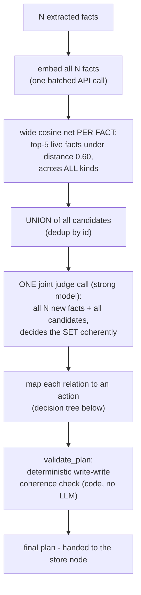

Division of labor, and why each stage exists:

- **Cosine nominates, never decides.** Embedding distance is blind to negation
  ("panics" vs "no longer panics" = 0.49 apart) and to numbers ("score 8/10"
  vs "7/10" = 0.012 apart) - both measured live in this repo. So the net is
  deliberately generous and cross-kind; its only job is to keep the judge's
  prompt small.
- **The judge decides relations, jointly.** One call sees all new facts plus
  all candidates, so sibling facts see each other (why that matters: diagram
  below). The reconcile judge runs on a stronger model than the workhorse
  (`RECONCILE_JUDGE_MODEL`): it is the highest-stakes call in the write path,
  it runs offline, and it is one call per source.
- **Code enforces what the prompt requests.** The judge is *asked* to be
  coherent; `validate_plan` *guarantees* it, deterministically.

The mapping from the judge's relation to a store action, per fact:

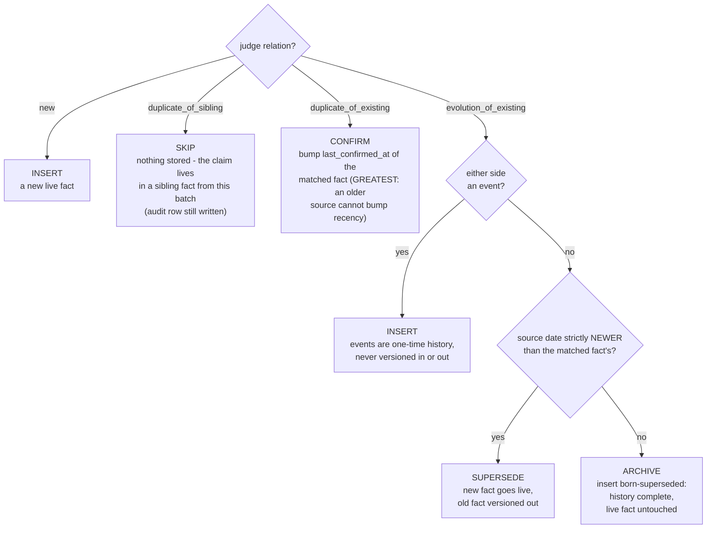

Note what the LLM does NOT decide: the supersede *direction*. The judge only
says "same aspect, statement changed" - which side wins is pure code comparing
source dates (event time). A re-ingested old document can never overturn newer
knowledge, in any processing order.

### 7.2 Why the judge call is joint: the lost-update bug

Found live, via agent triage of human-flagged reviews. When each fact was
judged separately, every decision was made against the same pre-batch store
snapshot - and two siblings matching the same live fact conflicted:

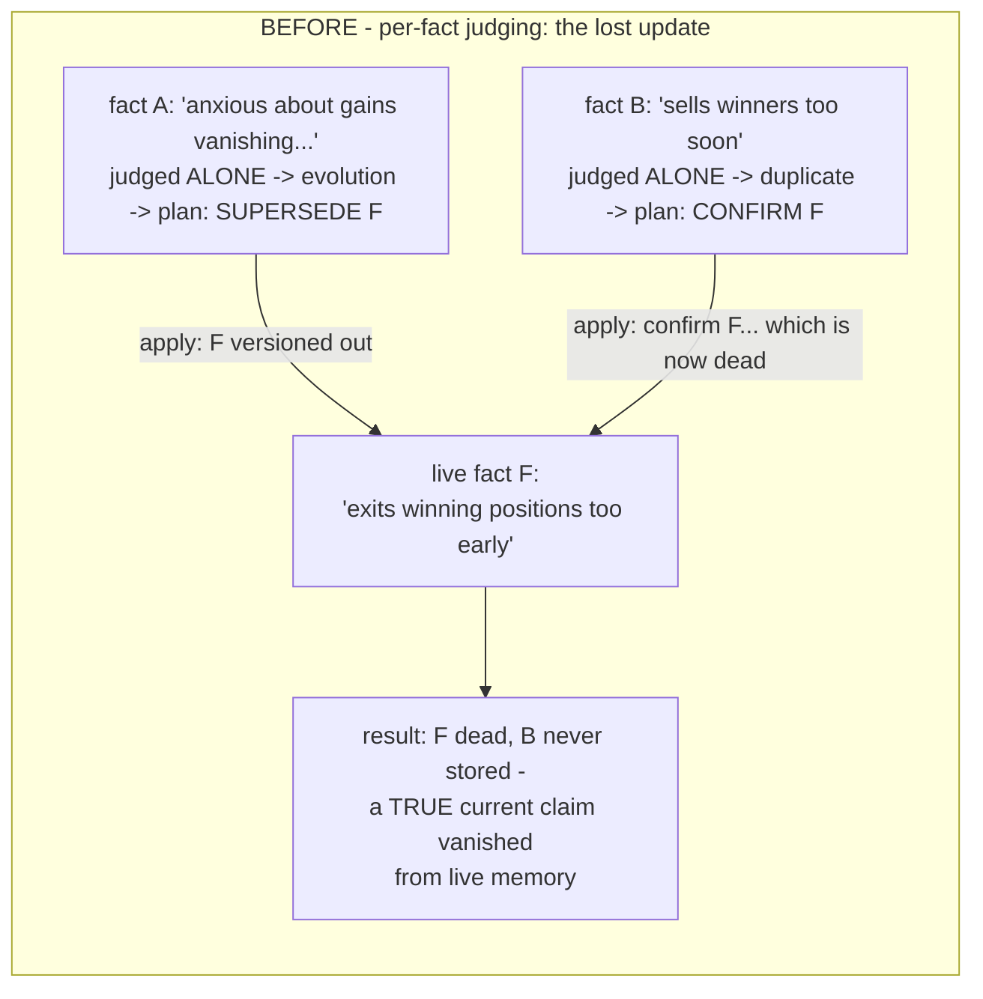

Each decision was correct against the state it saw; applying both together was
wrong - a classic write-write conflict (a DB person would say *lost update*).
The fix is the industry-standard shape (Mem0 decides its ADD/UPDATE/DELETE/
NOOP set in one joint call; Graphiti dedupes new-vs-new per episode before
resolving against the graph), plus a safety net in code:

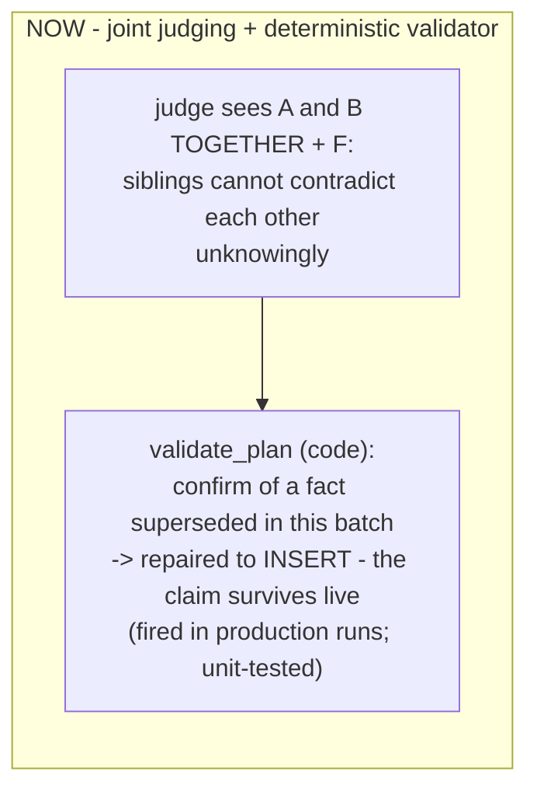

### 7.3 The import layer: source-agnostic by contract

The paid trial is "migrate our existing student reports" - and their data's
shape is unknown until day one. So the boundary is defined from OUR side:
whatever the source, it must yield students with reports and conversations.

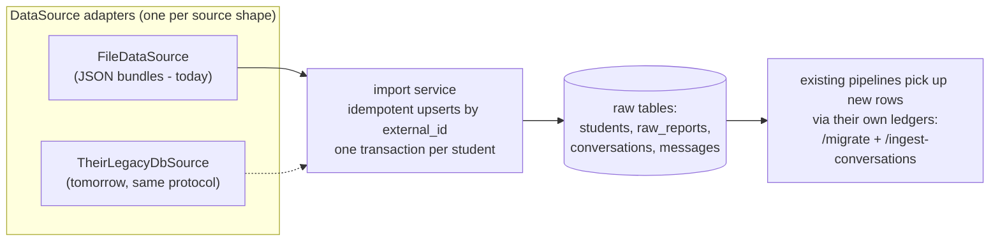

Three production rules baked in: **identity** (every record carries the source
system's `external_id`; re-import is `ON CONFLICT DO NOTHING` - idempotent by
structure, verified: a second import skips 100%), **streaming** (bundles are
iterated one student at a time with per-student transactions - a 7,000-student
import is resumable, not all-or-nothing), and **one writer per concern**
(import lands raw data only; fact extraction stays in the migrate/ingest
pipelines behind their own ledgers).

The demo corpus itself (`data/`) is generated by `scripts/generate_dataset.py`:
10 synthetic students from an explicit taxonomy (archetype x timeline shape x
failure-mode flags), each defined first as a **world model** (versioned truth
chains) from which reports and transcripts are *rendered* - so golden eval
cases derive mechanically from ground truth the pipeline never sees. Artifacts
are checked in; evals are reproducible without regeneration.

## 8. What the demo deliberately does NOT do

Scope cuts, each with the production answer ready:

| Cut from demo | Production answer |
|---|---|
| Conversation ingestion is a manual batch endpoint | same write path, triggered automatically per finished conversation |
| Memory consolidation over time | offline job merging/pruning facts, gated by evals, never inline |
| Real auth | JWT/session -> `app.student_id`; RLS stays as the floor |
| Voice (LiveKit) | preload report + top-N stable facts at session start; retrieval must never block the speech loop |
| HNSW index, caching, migrations tooling | added when scale demands, not before |

## 9. QA: observability and evals

Two layers of quality control, split by cost - the same split a real team uses.

**Logging (free, always on).** Every write-path node and read-path request logs
what it did. `LOG_LEVEL=INFO` (default) shows per-report / per-request
summaries; `LOG_LEVEL=DEBUG` shows the per-fact reconcile decision and the
nearest-existing distance that drove it - the "why was this fact superseded /
skipped" audit trail. This is what makes the LangGraph "per-step observability"
claim (section 7) real rather than aspirational.

**Evals (paid, on demand).** `evals/` scores retrieval and answer quality
against a hand-built golden set (`evals/golden_set.py`), mirroring the real
plan: a golden set from the ~7,000 existing student Q&A pairs.

- **Recall** - does a retrieved fact *entail* the claim a human marked relevant?
  Scored by an LLM judge doing an entailment/contradiction (NLI) decision, NOT a
  substring or cosine match. Why: the stored fact is LLM-generated, so wording
  varies - exact-substring false-fails on paraphrase (the SQuAD "France" vs
  "French" -> 0 problem), and cosine similarity is blind to negation ("panics"
  vs "no longer panics" score ~identical). An LLM/NLI judge reads meaning *and*
  polarity. (At scale: cosine-filter to shortlist candidates, then judge.)
- **Supersede** - does *no* retrieved fact *contradict* the expected claim? The
  same judge's `contradicted` flag - a versioned-out, opposite-polarity fact
  (Bob's old "panics on losses") must not leak.
- **Groundedness** - LLM-as-judge: did the answer use only retrieved facts, or
  invent one? A correct refusal counts as grounded.

The golden set (`evals/golden_set.py`) is **independent** ground truth - claims
a human wrote, not the model's own output (that would be circular: a dropped
field would pass because the golden dropped it too).

**Failure localization (the stage funnel).** The golden cases run END-TO-END,
so a bare FAIL cannot say which stage broke. When top-k recall fails, a second
judge call checks whether the claim exists ANYWHERE in the student's live
store: absent = extraction/reconcile miss (write-path lever); present but not
in top-k = ranking miss (retrieval lever - scoring, `TOP_K`); retrieved but
the answer unsupported = generation miss (answer-prompt lever). The scorecard
prints failures by stage - the same "localize, then use that stage's lever"
discipline as error analysis, made mechanical.

The **deterministic, free** gate that belongs in CI is the cross-student
leakage suite (`tests/test_isolation.py`); the **paid, judged** evals run
deliberately, when a prompt or the retrieval ranking changes.

**Read-path audit (`retrieval_audit` + `/review/answers`).** Every `/ask` is
ledgered: the question, the answer, and the exact **ranking snapshot** it used
(memory ids, scores, ranks) - captured at answer time because rankings drift
as the store evolves and can never be reconstructed later. Refusals are
audited too (a spike of empty retrievals is a finding). Written as `tal_app`
inside the student-scoped transaction, so RLS `WITH CHECK` guarantees a
request can only audit its own student; the app role is INSERT-only - requests
write the ledger, operators read it. This is the other half of the audit
story: `extraction_audit` answers "why does the system believe X",
`retrieval_audit` answers "why did it SAY Y" - and it's where real-traffic
eval data accumulates (logged Q&A -> labeled -> golden cases). Answers get
**flag-only** review (no approve: a stream never "completes" - unreviewed is
the default state; operators mark the bad ones they spot). A flagged answer -
question + ranking snapshot + the human's note - exports via `/review/labels`
as a ready eval-case candidate.

**Human review (`/review`).** Every write-path decision lands durably in
`extraction_audit` - the fact, the action, which live fact it was judged
against, the judge's verdict and reason - written in the SAME transaction as
the action itself. The `/review` pages (server-rendered, no JS framework) show
each source next to its decisions; a human approves or flags each one (with
undo). Flags are human LABELS with a concrete destination: `/review/labels`
exports them as eval-case candidates (JSON) to become golden-set cases and
judge-validation examples - the review tool is how the eval corpus gets built.
Approved rows stay as evidence ("a human checked this batch"); every row stays
in `extraction_audit` permanently as the audit trail. In a real migration:
review 100% during the pilot batch, then all supersede/archive decisions plus
a sample of inserts. This reviews STORE OUTCOMES; tracing (below) reviews
individual LLM calls - two different lenses, both needed.

**LLM tracing (LangSmith).** Because the stack is LangChain + LangGraph, setting
the `LANGSMITH_*` env vars (see `.env.example`) captures every graph node, LLM
call, embedding call, and eval judge as a nested trace - inputs, outputs, tokens,
latency - with zero app-code changes. These traces are the raw material for
error analysis ("read 30-50 real traces, find the failure modes"). Data-residency
caveat: LangSmith's default endpoint is hosted, and traces contain student
psychological facts - for FCA-regulated data, self-host (Langfuse/Phoenix) or a
self-hosted LangSmith endpoint. App code stays vendor-neutral; enabling tracing
is env-only.

## 10. Running it

```bash
docker compose up -d          # Postgres 17 + pgvector, schema + seed auto-applied
cp .env.example .env          # put your OPENAI_API_KEY in .env
uv sync                       # install exact locked dependencies
uv run uvicorn app.main:app --reload
```

Then:

```bash
curl -X POST localhost:8000/import                # land the 10-student corpus (idempotent)
curl -X POST localhost:8000/migrate
curl -X POST localhost:8000/ingest-conversations
curl "localhost:8000/students/11111111-1111-1111-1111-111111111111/ask?q=how%20should%20I%20handle%20exits"

# or open http://localhost:8000/chat - an interactive bench for the READ path:
# pick a student, ask, and see the answer next to the exact facts retrieval
# pulled and their similarity x recency scores (a superseded fact stays out).
# then open http://localhost:8000/review - approve/flag every write-path decision
# or drive the whole flow from http://localhost:8000/wizard - the trial task as
# a guided product: import -> distill (background) -> review -> assess quality
# (a scoped store-invariant sweep with a green/red verdict). Every step is
# idempotent; a second wave of students for live-demoing it sits in
# data/students-wave2/ (no golden cases - wizard material, not eval material).

uv run pytest                              # leakage + plan-coherence suites (free, CI gate)
uv run python -m evals.run                 # REPORT: quality scorecard (exit 0)
uv run python -m evals.run --fail-under 0.8 # GATE: exit 1 if any metric rate < 0.8
uv run python -m evals.run --split dev     # dev split only (tune against this one)
uv run python -m evals.run --split test    # held-out split (never tune on it)
uv run python -m evals.run --no-judge      # dry run: answers only, no paid judge calls
uv run python -m evals.store_invariants    # STORE health: no contradicting live facts
                                           # (catches latent corruption behavioral evals miss)
LOG_LEVEL=DEBUG uv run python -m evals.run # see per-fact reconcile decisions
```

## 11. Glossary

| Term | Meaning |
|---|---|
| Embedding | text turned into a vector of ~1536 floats; texts with similar *meaning* get nearby vectors |
| Vector search | "find rows whose embedding is nearest to this query's embedding" - search by meaning, not keywords |
| pgvector | Postgres extension adding a `vector` column type + distance operators |
| RAG | Retrieval-Augmented Generation: fetch relevant text, put it in the prompt, let the LLM answer from it (the read path above is RAG over memories) |
| Structured output | forcing the LLM to return a typed object instead of prose, validated at the API boundary |
| LangChain | SDK of building blocks: chat model clients, prompts, embeddings |
| LangGraph | state-machine runtime on top: nodes, edges, persisted state |
| FastAPI | Python's minimal-API web framework |
| RLS | row-level security: a per-row visibility policy enforced inside Postgres |
