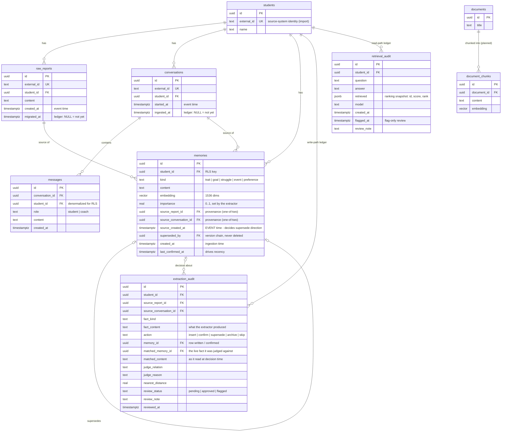
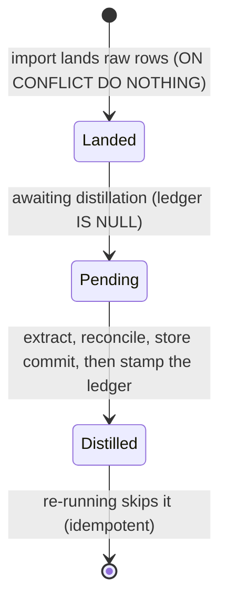
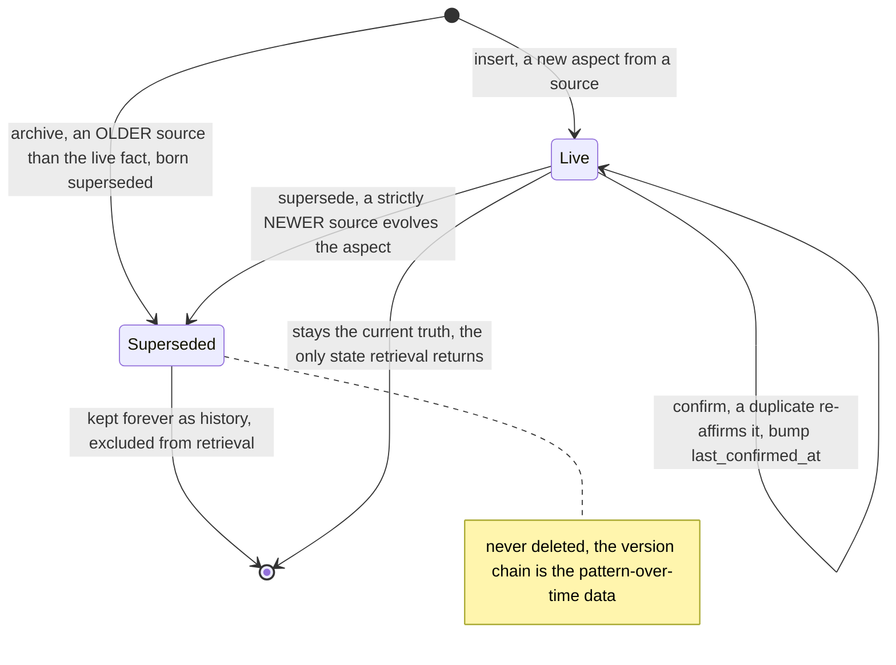

# Domain model (personal-memory core)

The entities of the coach's personal-memory layer, their relationships, the core entity's lifecycle,
and the domain events that map to write- and read-path stages. Flat (single implicit area) - one
bounded context, the personal-memory core. The ubiquitous nouns are in [glossary.md](glossary.md);
the component view is in [system-design.md](system-design.md) (C4 L3).

Governing decisions:
[ADR-0001](../adr/0001-two-homes-memory-vs-knowledge-base.md) (personal memory vs knowledge base - the
two stores below the dashed line are planned and out of trial scope),
[ADR-0002](../adr/0002-versioning-by-supersede.md) (facts are versioned by `superseded_by`, never
updated or deleted),
[ADR-0003](../adr/0003-provenance-on-every-fact.md) (every fact links to exactly one source),
[ADR-0004](../adr/0004-supersede-direction-by-source-date.md) (`source_created_at` decides supersede
direction),
[ADR-0006](../adr/0006-idempotency-by-ledger.md) (the `migrated_at` / `ingested_at` ledgers),
[ADR-0007](../adr/0007-per-student-isolation-via-rls.md) (per-student RLS). Re-sliced by scope from
[../../README.md](../../README.md).

## Entity model

All tables use `uuid` PKs via `gen_random_uuid()` and `timestamptz`. Personal tables carry
`student_id` and are under RLS ([ADR-0007](../adr/0007-per-student-isolation-via-rls.md)); the planned
knowledge-base tables are shared and un-scoped. `external_id` (UNIQUE, nullable) is the record's
identity in the SOURCE system - what makes bulk import idempotent by structure. A fact's provenance is
a one-of-two: exactly one of `source_report_id` / `source_conversation_id` is set
([ADR-0003](../adr/0003-provenance-on-every-fact.md)).

Per non-obvious cardinality:

- **students ||--o{ memories, and memories o|--o| memories (the version chain).** A student holds many facts; a fact points to at most one successor (`superseded_by`). The chain is the "notice patterns over time" data: "used to exit winners early (Jan)" links forward to "lets winners run now (Jun)". Facts are never updated or deleted, so the chain is the audit trail of how the student changed ([ADR-0002](../adr/0002-versioning-by-supersede.md)).
- **raw_reports ||--o{ memories and conversations ||--o{ memories (provenance, one-of-two).** A fact traces to exactly one source - a report OR a conversation, never both, never neither. This is a CHECK-enforceable one-of-two, not two independent nullable FKs by convention: it is what makes the anti-hallucination rule ("state only what you retrieved, and it traces to a source") enforceable rather than aspirational ([ADR-0003](../adr/0003-provenance-on-every-fact.md)). The two sources have INDEPENDENT ledgers (`migrated_at`, `ingested_at`) and can be processed in any order, which is exactly why supersede direction cannot depend on processing order ([ADR-0004](../adr/0004-supersede-direction-by-source-date.md)).
- **memories o|--o{ extraction_audit (decision about).** One reconcile decision writes one audit row; a row references the memory it wrote or confirmed and, separately, the live fact it was judged against (`matched_memory_id`) with that fact's text frozen at decision time (`matched_content`) - because the matched fact may itself be superseded later, and the audit must read as it read then. An audit row is written even when the action stored nothing (a `confirm` or a `skip`), so the ledger is complete.
- **messages.student_id (denormalized).** `messages` carries `student_id` even though it is reachable via `conversation_id`, so the RLS policy is a single-column predicate on every personal table rather than a join ([ADR-0007](../adr/0007-per-student-isolation-via-rls.md)).
- **documents ||--o{ document_chunks (planned, un-scoped).** The knowledge base is shared course content with no `student_id` and no RLS - a different store with a different paradigm, drawn here only to fix the boundary. Out of trial scope ([ADR-0001](../adr/0001-two-homes-memory-vs-knowledge-base.md)).

Config-as-data / source entities: **raw_reports**, **conversations** + **messages**.
Curated store: **memories**.
Audit ledgers: **extraction_audit**, **retrieval_audit**.
Planned (knowledge base, out of trial scope): **documents**, **document_chunks**.

**Schema evolution.** The demo bootstraps from `schema.sql` (create-from-scratch, fine for a fresh
container). The brownfield system ships schema changes as versioned migrations (Alembic) against the
live database - additive first, destructive never during the trial. Named here so it is not mistaken
for a non-decision.

## Lifecycle

Two lifecycles carry the system: a **source** (a report or a conversation) moves from un-distilled to
distilled once, and a **fact** - the core entity - is born in one of the reconcile actions and, once
live, may be confirmed or versioned out. A student has no state machine of its own; its evolving
picture IS the set of live facts and their version chains.

### Source distillation lifecycle

A report or conversation is landed by import, then distilled exactly once. The ledger column
(`migrated_at` / `ingested_at`) is the state, stamped only after the facts commit, so a crash
mid-distill leaves the source Pending and a re-run resumes it ([ADR-0006](../adr/0006-idempotency-by-ledger.md)).

### Fact lifecycle (the core entity)

A fact is created by one of the reconcile actions and, once live, is either re-confirmed by later
duplicate sources or versioned out by a strictly newer source. It is never updated in place and never
deleted ([ADR-0002](../adr/0002-versioning-by-supersede.md)). `skip` produces no fact (a sibling
duplicate - an audit row only).

The direction of the `Live --> Superseded` transition is decided by comparing `source_created_at`
(event time), never processing order: an older source arriving late is archived rather than allowed to
overturn newer knowledge ([ADR-0004](../adr/0004-supersede-direction-by-source-date.md)). This is what
makes the two independent write-path ledgers safe to run in any order.

## Domain events

The events that drive the system; doubles as the write- and read-path stage map. "Owner" events run
under the RLS-bypassing operator role; the read-path event runs under the student-scoped app role.

| Event (past tense) | Trigger | Produces (state / read-model) | Stage |
|---|---|---|---|
| ReportLanded / ConversationLanded | `POST /import` reads a `DataSource` bundle | immutable `raw_reports` / `conversations` + `messages` rows (`ON CONFLICT DO NOTHING`), ledger NULL | import (owner) |
| ReportMigrated | `POST /migrate` distills a Pending report | facts written, `raw_reports.migrated_at` stamped | migrate (owner) |
| ConversationIngested | `POST /ingest-conversations` distills a Pending conversation | facts written, `conversations.ingested_at` stamped | ingest (owner) |
| FactsExtracted | the extract node runs on one source's text | typed `Fact` objects (structured output), the student's name injected | extract |
| FactInserted | reconcile relation = `new` | a new live `memories` row with provenance + embedding | reconcile / store |
| FactConfirmed | reconcile relation = `duplicate_of_existing` | the matched live fact's `last_confirmed_at` bumped (never past an older source's date); no new row | reconcile / store |
| FactSuperseded | relation = `evolution_of_existing`, new source strictly newer | new fact live, old fact's `superseded_by` set | reconcile / store |
| FactArchived | relation = `evolution_of_existing`, new source older | new fact inserted already-superseded (born dead), live fact untouched | reconcile / store |
| FactSkipped | relation = `duplicate_of_sibling` | nothing stored; an `extraction_audit` row still written | reconcile / store |
| DecisionRecorded | any reconcile action | one durable `extraction_audit` row (fact, action, matched fact + reason), in the SAME transaction as the action | store |
| DecisionReviewed | operator approves / flags in `/review` | `extraction_audit.review_status` set; a flag becomes an eval-case candidate | review (owner) |
| AnswerServed | `GET /students/{id}/ask?q=` | a grounded answer, and a `retrieval_audit` row with the ranking snapshot | retrieve (app role, RLS) |
| AnswerFlagged | operator flags an answer in `/review/answers` | `retrieval_audit.flagged_at` set; a flagged answer is a golden-case candidate | review (owner) |
| DocumentChunked (planned) | knowledge-base ingestion | `document_chunks` with passage embeddings (no `student_id`, no RLS) | KB ingest (out of trial scope) |

No event mutates a fact in place: evolution is always a new row plus a `superseded_by` link, which is
why the version chain is a complete history and the store-invariant monitor can assert "no student
holds two contradicting live facts" over just the live set.
