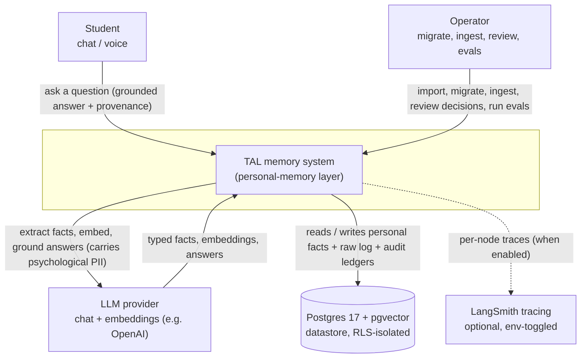
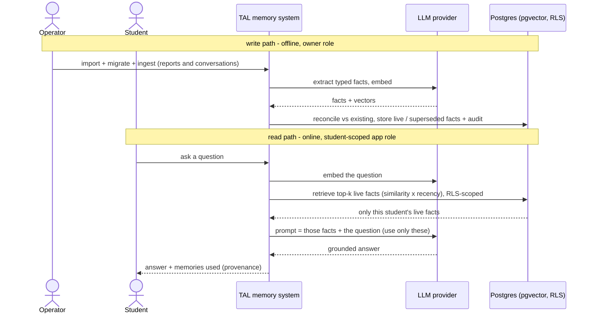

# System context (C4 L1)

The current C4 level 1 view: the TAL memory system as one box, its human actors, and every external
system it depends on. The action edge is deliberately drawn from the Student to TAL - the memory
system serves the coach, it does not reach out to anyone.

Related: [system-design.md](system-design.md) (C4 L2 containers + flows),
[domain-model.md](domain-model.md), [cross-cutting.md](cross-cutting.md),
[glossary.md](glossary.md). Governing decisions:
[ADR-0001](../adr/0001-two-homes-memory-vs-knowledge-base.md) (personal memory vs knowledge base),
[ADR-0007](../adr/0007-per-student-isolation-via-rls.md) (per-student isolation). Re-sliced by scope
from [../../README.md](../../README.md).

What crosses each boundary:
- **Student <-> system**: inbound a question (chat or voice); outbound a grounded answer plus the memories it used (provenance). The student never sees another student's data - isolation is enforced in the datastore ([ADR-0007](../adr/0007-per-student-isolation-via-rls.md)).
- **Operator <-> system**: inbound the write-path and quality actions (import raw data, migrate reports, ingest conversations, review decisions, run evals); outbound migration counts, review queues, and eval scorecards. This is the owner-role surface (`/wizard`, `/review`), never exposed to a student.
- **LLM provider <-> system**: outbound extraction prompts, embedding requests, and grounded-answer prompts; inbound typed facts, vectors, and answers. Provider-shaped today (OpenAI chat + embeddings); the natural seam is an `LLMProvider` port so the vendor is an adapter, not a binding. Carries student psychological PII - the main data-processor exposure ([cross-cutting.md](cross-cutting.md)).
- **Postgres + pgvector <-> system**: the system's own datastore - it holds our schema (raw log, curated facts, audit ledgers), not a third-party system of record. Shown as a dependency because it is the durability boundary; per-student RLS lives here, not in application code. How isolation is enforced is an L2 concern fixed by [ADR-0007](../adr/0007-per-student-isolation-via-rls.md).
- **LangSmith tracing <-> system** (optional): outbound per-node traces of every LLM/graph call when `LANGSMITH_*` env vars are set - zero app-code coupling. For FCA-regulated data the endpoint is a data-residency decision (self-host), named in [cross-cutting.md](cross-cutting.md).

The **knowledge base** (classic RAG over shared course content) is a SECOND, deliberately separate
store, not drawn as an external system because it is a planned internal subsystem with its own
paradigm and no per-student isolation - out of trial scope ([ADR-0001](../adr/0001-two-homes-memory-vs-knowledge-base.md)).

## Boundary runtime flow

The two loops at the boundary: the operator distills sources into memory (offline, write path), and a
student asks a question answered from memory (online, read path). The system stays one box;
container-level sequences are L2 ([system-design.md](system-design.md)).

The write path is resolved at L2 as an extract -> reconcile -> store graph; the read path as a linear
embed -> retrieve -> ground -> answer. Reconcile's decision is an LLM judge, not a distance cutoff, and
supersede direction is decided by source dates - both are L2/decision detail
([system-design.md](system-design.md), [ADR-0004](../adr/0004-supersede-direction-by-source-date.md),
[ADR-0005](../adr/0005-reconcile-by-joint-judge.md)).

## Scope notes

- The L2 container view (the FastAPI app, in-process operator jobs, the datastore) and the runtime
  sequences are drawn in [system-design.md](system-design.md).
- Entity shapes (ERD, fact lifecycle, events) are in [domain-model.md](domain-model.md).
- The knowledge-base subsystem is target architecture only, beyond the trial
  ([ADR-0001](../adr/0001-two-homes-memory-vs-knowledge-base.md)).
