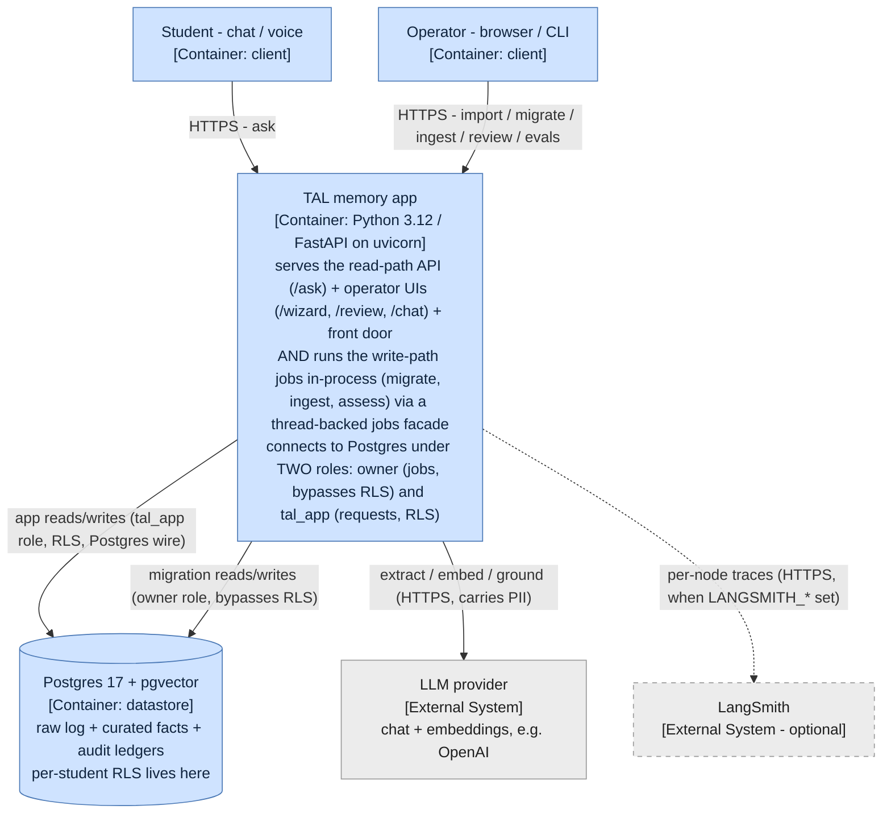
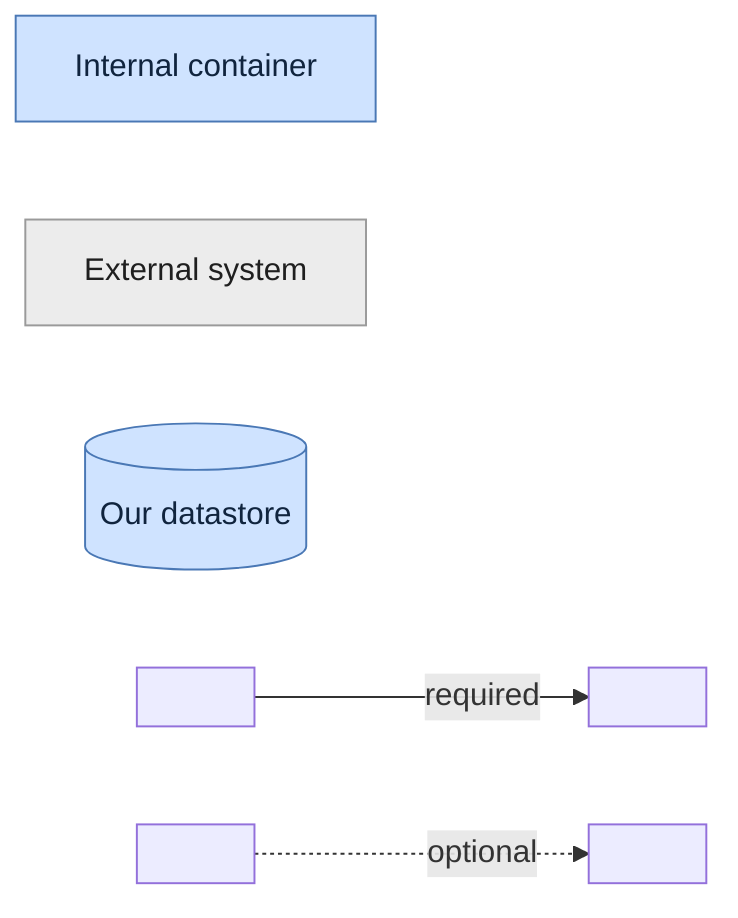
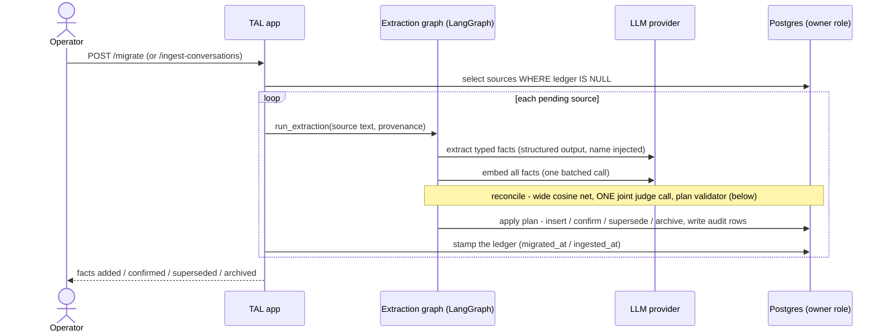
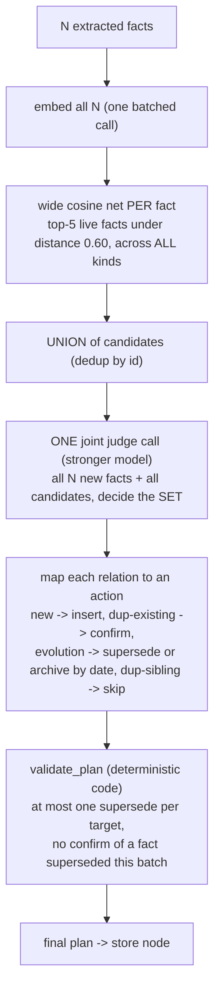
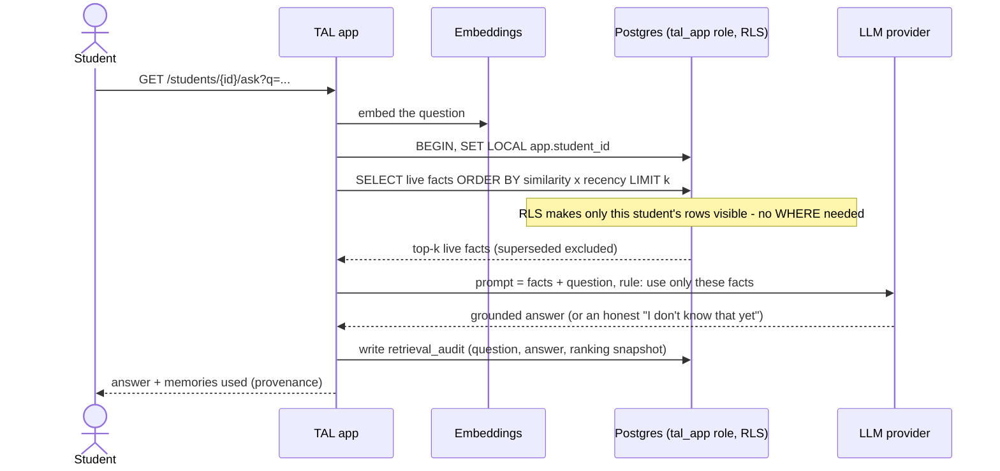
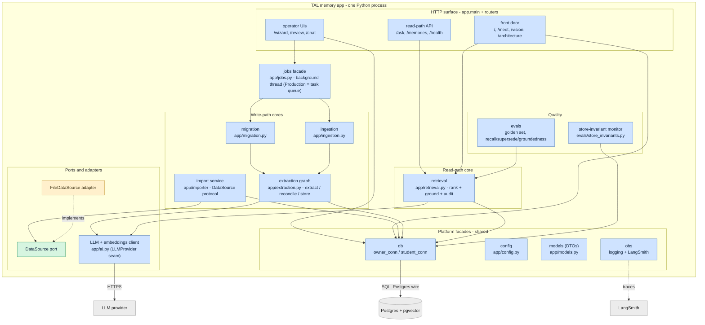
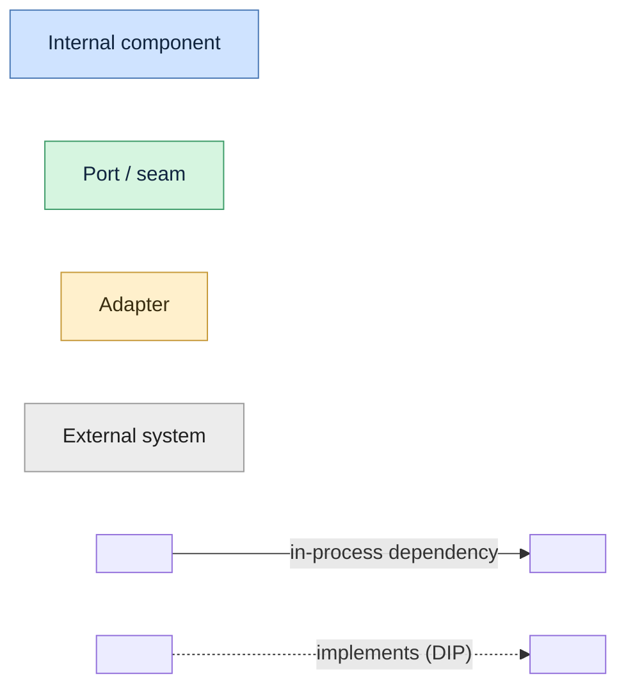

# System design (C4 L2 + L3) - containers, runtime flows, and components

The container view of the TAL memory system (C4 L2) plus the component decomposition inside the app
process (C4 L3): the separately runnable units, the protocols between them, the highest-judgment
runtime flows, and the components that make up the one Python process. The L1 system context is in
[system-context.md](system-context.md); the data model in [domain-model.md](domain-model.md);
cross-cutting concerns in [cross-cutting.md](cross-cutting.md). Governing decisions:
[ADR-0004](../adr/0004-supersede-direction-by-source-date.md) (supersede by source date),
[ADR-0005](../adr/0005-reconcile-by-joint-judge.md) (joint-judge reconcile + validator),
[ADR-0006](../adr/0006-idempotency-by-ledger.md) (ledgers),
[ADR-0007](../adr/0007-per-student-isolation-via-rls.md) (RLS + two roles),
[ADR-0008](../adr/0008-no-ann-index-on-personal-memory.md) (no ANN index),
[ADR-0009](../adr/0009-langgraph-write-path-only.md) (LangGraph on the write path only). Re-sliced by
scope from [../../README.md](../../README.md).

## Containers

The separately runnable and deployable units inside (and at the edge of) the TAL boundary, and the
protocols between them. The test for a container here is "something that has to be running for the
system to work" - a process or a datastore - not a code grouping inside one of them (that is L3).

The web API, the operator UIs, and the write-path jobs are three ROLES of a SINGLE Python process:
the demo runs the distill/assess jobs in-process behind a thread-backed jobs facade, so they are ONE
container, annotated with all three responsibilities. Internal units are blue; external systems we
depend on but do not control are grey; the optional tracing edge is dashed. A legend follows.

**Legend.**

A **solid** arrow is an always-present relationship; a **dashed** arrow is optional (tracing).
**Rectangle** = process/container, **cylinder** = datastore. **Blue** = internal (including our own
managed datastore), **grey** = external system we integrate with but do not own. Arrows point from
caller to dependency; the response is implied.

Container by container, and why each qualifies:
- **TAL memory app**: one Python process (`uvicorn app.main:app`). It is a single container because the read-path requests, the operator UIs, and the write-path jobs all run in the same process; the jobs facade (`app/jobs.py`) runs distill/assess on a background thread, not a separate process. **Peel-safety**: the no-rewrite peel of the write-path jobs onto their own process (or a task queue) holds only while requests and jobs share state solely through Postgres - the demo's jobs facade is a thread today, `Production = task queue` is named in the code. The two DB roles are the trust boundary drawn INTO this one container: `owner_conn()` (bypasses RLS, migration/ingestion/review only) and `student_conn()` (RLS enforced, request-scoped) - routing a request through the owner role would silently void isolation ([ADR-0007](../adr/0007-per-student-isolation-via-rls.md)).
- **Postgres + pgvector**: the datastore container; one instance holds the raw log, the curated `memories`, and both audit ledgers. It is internal (we own the schema), managed-hosted in production. Per-student RLS is enforced HERE, in the database, not in application code - so a forgotten `WHERE student_id = ...` cannot leak data ([ADR-0007](../adr/0007-per-student-isolation-via-rls.md)). Deliberately NO ANN/HNSW index on personal memory: within one student's few-hundred rows an exact scan is faster and exact ([ADR-0008](../adr/0008-no-ann-index-on-personal-memory.md)).
- **LLM provider** (external): chat + embeddings. Every fact extraction, every embedding, and every grounded answer crosses this edge carrying student PII. The reconcile judge runs on a STRONGER model than the extraction/answer workhorse - the highest-stakes call, offline, one per source ([ADR-0005](../adr/0005-reconcile-by-joint-judge.md)). The natural seam is an `LLMProvider` port; today it is the `app/ai.py` client.
- **LangSmith** (external, optional): captures every graph node and LLM call as a nested trace when env-enabled, with no app-code change. For FCA data this endpoint is a residency decision (self-host) - [cross-cutting.md](cross-cutting.md).

## Key runtime flows

The highest-judgment flows, all consistent with the [L1 boundary flow](system-context.md#boundary-runtime-flow)
and the [fact lifecycle](domain-model.md#fact-lifecycle-the-core-entity). Because the web and jobs are
one container, the app appears once and a note marks when it is acting in its in-process job capacity.

### Write path - distill a source into facts (migrate / ingest)

Both sources share one extraction graph. Idempotent via the ledgers: a second run skips already-distilled
sources ([ADR-0006](../adr/0006-idempotency-by-ledger.md)).

### Reconcile internals - from N facts to a coherent plan

Where most of the write-path judgment lives. Cosine nominates candidates; a single joint judge decides
the set; code enforces write-write coherence ([ADR-0005](../adr/0005-reconcile-by-joint-judge.md)).

Cosine is blind to negation ("panics" vs "no longer panics" = 0.49 apart) and to numbers ("score 8/10"
vs "7/10" = 0.012 apart), both measured live - so the net only shortlists; the judge decides relations,
and dates decide the supersede DIRECTION ([ADR-0004](../adr/0004-supersede-direction-by-source-date.md)).
The judge call is JOINT (all new facts + all candidates at once) because per-fact judging against the
pre-batch snapshot produced a live lost update - two sibling facts matching the same live fact, one
superseding it and one confirming the now-dead fact; the confirmed claim vanished from live memory. The
same industry fix as Mem0's joint ADD/UPDATE/DELETE/NOOP call and Graphiti's new-vs-new dedupe, plus
`validate_plan` as a deterministic safety net (unit-tested in `tests/test_plan_coherence.py`).

### Read path - answer a question from memory

Linear, stateless, request-scoped - deliberately NOT a graph ([ADR-0009](../adr/0009-langgraph-write-path-only.md)).
RLS scopes the transaction to one student.

## Components (C4 L3)

The component decomposition inside the single app process. Everything blue is a component of the one
container; grey is external. Components are grouped by their stable seam. A solid arrow is an in-process
dependency; a dashed arrow is an adapter implementing a port (the dependency-inversion direction); an
edge crossing to an external system carries its wire protocol. All cores read config via `config` and
emit logs/traces via `obs`; those ubiquitous edges are stated once here rather than drawn.

**Legend.**

### Component catalog

| Component | Responsibility | Seam / port | Module |
|---|---|---|---|
| read-path API | `/ask` grounded answer + provenance; `/memories`; `/health` | reads via retrieval | `app/main.py` |
| operator UIs | Migration wizard, human review of write-path decisions, retrieval bench | owner role | `app/wizard.py`, `app/review.py`, `app/chat.py` |
| front door | Non-technical landing, the memory-evolution story, vision, this architecture view | reads via retrieval / db | `app/frontdoor.py`, `app/meet.py`, `app/architecture.py` |
| jobs facade | Run distill/assess on a background thread; progress read from the ledgers so a crash resumes | - | `app/jobs.py` |
| import service | Land raw student data from any `DataSource` into the raw tables, idempotent by `external_id`, one tx per student | `DataSource` port | `app/importer/` |
| migration | Reports -> facts; idempotent via `migrated_at` | calls extraction | `app/migration.py` |
| ingestion | Conversations -> facts (same extraction path); idempotent via `ingested_at` | calls extraction | `app/ingestion.py` |
| extraction graph | extract (LLM structured output) -> reconcile (cosine net + joint judge + validator) -> store (apply plan + audit) | `LLMProvider` seam | `app/extraction.py` |
| retrieval | Rank live facts by similarity x recency under top-k, ground the answer, write the read-path audit | `LLMProvider` seam | `app/retrieval.py` |
| DataSource port + FileDataSource | The import contract; the file adapter today, the client's export a second adapter with zero service change | port + adapter | `app/importer/` |
| LLM + embeddings client | The one place that talks to the LLM/embeddings vendor - the `LLMProvider` seam | seam | `app/ai.py` |
| db | Two connection factories, two trust levels: `owner_conn` (bypasses RLS) and `student_conn` (RLS, `SET LOCAL`) | - | `app/db.py` |
| config / models / obs | Env config; Pydantic DTOs incl. the extractor's structured-output schema; logging + LangSmith | - | `app/config.py`, `app/models.py`, `app/obs.py` |
| evals | Golden-set scorecard: recall / supersede (NLI-style judge) and groundedness | reads via retrieval | `evals/` |
| store-invariant monitor | Judge the STORE, not answers: no student holds two contradicting live facts | reads db | `evals/store_invariants.py` |

### Ports and adapters direction

The dependency-inversion seam: cores and ports MUST NOT import adapters; an adapter implements a port
and is bound to a source shape only at the composition edge. This is why the client's real export
becomes a NEW `DataSource` adapter file, not a change to the import service, the migration pipeline, or
any core. The `DataSource` protocol carries this today; the `LLMProvider` seam (`app/ai.py`) is the
same shape for the vendor and is the natural next port when a second provider lands.

### Two roles inside one process (the isolation boundary)

The trust boundary is drawn INTO the single container: `owner_conn()` bypasses RLS and is used only by
migration, ingestion, review, and seeding; `student_conn()` runs every request under the `tal_app` role
with `SET LOCAL app.student_id`, so RLS makes only that student's rows visible and the setting dies with
the transaction (pooler-safe). The read path deliberately has NO `WHERE student_id = ...` - the policy
supplies it, which is the point: isolation cannot depend on every query remembering the predicate
([ADR-0007](../adr/0007-per-student-isolation-via-rls.md)). `tests/test_isolation.py` asks one
student's question in another's session and asserts nothing leaks.
